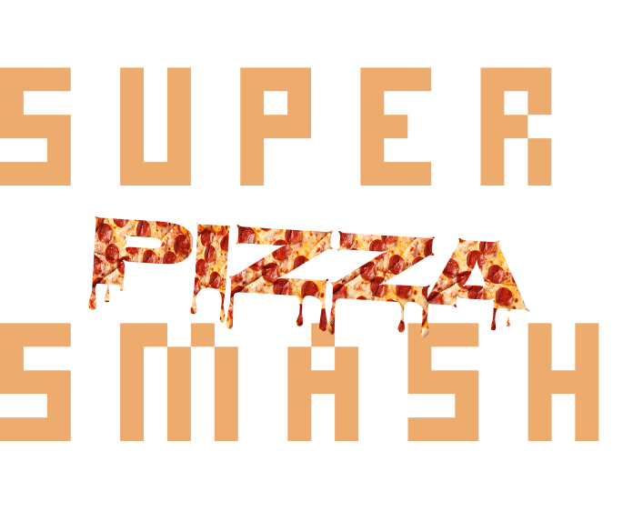
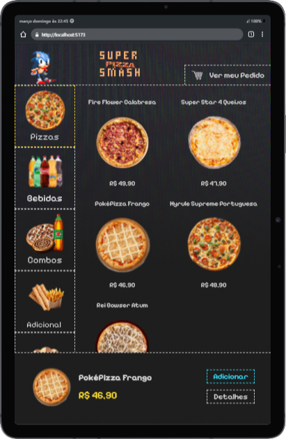

<h1 align="center">  </h1>

O projeto consiste no desenvolvimento de um Sistema de Compra de Lanches para Totens de Fast Food, permitindo que os clientes façam pedidos de maneira rápida e intuitiva por meio de telas sensíveis ao toque ou comandos de voz. O sistema facilita a escolha dos produtos, quantidade, forma de pagamento e inclui recursos de acessibilidade, como audiodescrição dos itens.

  <a href="#🚀-tecnologias">Tecnologias</a>&nbsp;&nbsp;&nbsp;|&nbsp;&nbsp;&nbsp;
  <a href="#💻-projeto">Projeto</a>&nbsp;&nbsp;&nbsp;|&nbsp;&nbsp;&nbsp;
  <a href="#🚧-arquitetura-de-rotas">Arquitetura de Rotas</a>&nbsp;&nbsp;&nbsp;|&nbsp;&nbsp;&nbsp;
  <a href="#👨‍💻-contribuidores">Contribuidores</a>&nbsp;&nbsp;&nbsp;|&nbsp;&nbsp;&nbsp;
  <a href="#📞-contato">Contato</a>

  

 

## 🚀 Tecnologias

Esse projeto foi desenvolvido com as seguintes tecnologias:

- React.js
- Vite.js
- Node.js
- LocalStorage

## 💻 Projeto

O Sistema de Compra de Lanches para Totens de Fast Food é uma solução tecnológica voltada para otimizar e modernizar o processo de pedidos em lanchonetes e restaurantes. Com um design intuitivo e acessível, o sistema permite que os clientes escolham os produtos, definam quantidades, visualizem detalhes e finalizem o pagamento diretamente pelo totem ou tablet.

Entre os diferenciais do projeto, destacam-se a realização de pedidos por comando de voz e a audiodescrição dos produtos, tornando a experiência mais inclusiva. A interface foi projetada especialmente para dispositivos de autoatendimento, garantindo uma experiência fluida e eficiente.

O sistema é desenvolvido utilizando React.js, Node.js e Vite.js, e conta com um banco de dados para armazenar informações sobre produtos e pedidos. Além disso, há um painel administrativo onde os gestores podem visualizar e gerenciar pedidos e produtos.

## 🚧 Arquitetura de rotas

- **/** - Rota inicial
- **/catalog** - Menu para escolha dos pedidos
- **/order** - Todos os pedidos selecionados
- **/payment** - Escolher a forma de pagamento
- **/paid** - Pagamento realizado

## 👨‍💻 Contribuidores

 

   <a href="https://github.com/matheusfdosan" target="_blank"> Matheus Faustino </a> 

 

   <a href="https://github.com/PedroCabs" target="_blank"> Pedro Cabral </a> 

 

   <a href="https://github.com/danrod278" target="_blank"> Daniel Rodrigues</a> 

## 📞 Contato

- Acesse também meus outros repositórios no [GitHub](https://github.com/matheusfdosan?tab=repositories).
- Siga-me no [Instagram](https://instagram.com/matheusfdosan).
- Conecte-se comigo no [LinkedIn](https://www.linkedin.com/in/matheusfaus/).
